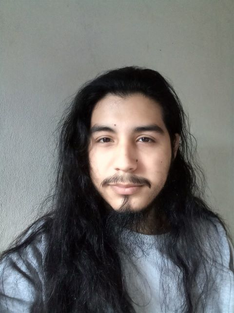

# Presentación

## Franco Leonel Casasola

Soy ***Franco Casasola***, mis amigos me dicen Casa, tengo 22 años. Ingrese en la universidad en el 2020, en la carrera de ***Ingenieria Electrica***, pero despues cursar Introduccion a la Programacion decidí cambiarme a la ***Licenciatura en Informatica***.

Actualmente tengo aprobadas las siguientes materias:
- Matematicas para Informatica 1
- Introduccion a logica y problemas computacionales
- Organizacion de Computadoras
- Nuevos Entornos
- Taller de lenguajes de marcado y tecnologias web
- Pragramacion estructurada
- Matematicas para Informatica 2
- Ingles 1
- materia UNAHUR

Algunos de mis hobbies son jugar al futbol, tocar la guitarra y el Counter-Strike

foto de perfil de discord, antes de cortarme el pelo : )
